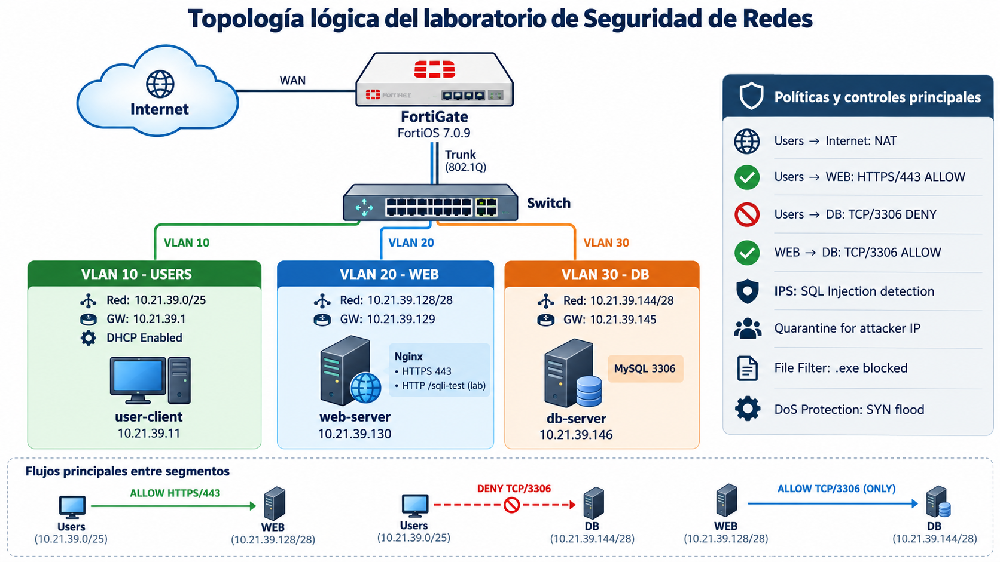
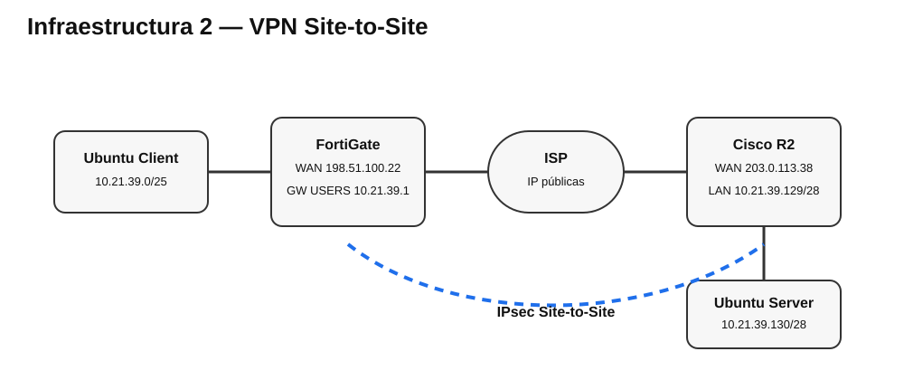

# Seguridad de Redes — Laboratorio FortiGate (Infraestructuras 1, 2 y 3)

## 🎥 Video demostrativo final

> **Enlace de entrega:** PENDIENTE — pegar aquí el enlace final de YouTube o OneDrive institucional.

El video final debe durar máximo 10 minutos, mostrar hora y fecha, incluir rostro y voz, y enfocarse únicamente en demostrar que las topologías cumplen sus objetivos de Seguridad de Redes.

> Video anterior de la primera fase del laboratorio: https://youtu.be/tVhtWXWO9dE

---

## Propósito general

Documentar e implementar tres escenarios de Seguridad de Redes con FortiGate, Cisco, GNS3 y sistemas Ubuntu. La práctica demuestra segmentación, políticas de firewall, NAT, servicios WEB/SSH, VPN Site-to-Site y VPN Remote Access, verificando que cada servicio solo sea accesible de la forma prevista por el diseño.

## Infraestructuras documentadas

### Infraestructura 1 — Segmentación y controles FortiGate

Segmentación de USERS, WEB y DB mediante VLANs y políticas de seguridad, incluyendo DHCP, NAT, HTTPS, control de acceso, IPS, File Filter y protección DoS.

[Ver documentación de Infraestructura 1](entrega/infraestructura-1.md)



### Infraestructura 2 — VPN Site-to-Site FortiGate ↔ Cisco

El usuario se comunica con el servidor únicamente cuando la VPN IPsec Site-to-Site está activa. Incluye FortiGate, Cisco R2, NAT, ISP con IP públicas simuladas, HTTPS, VLAN 10, DHCP y traceroute.

[Ver documentación de Infraestructura 2](entrega/infraestructura-2.md)



### Infraestructura 3 — HTTPS sin VPN y SSH por VPN Remote Access

El usuario accede al servidor WEB por HTTPS sin VPN mediante un VIP de FortiGate, mientras que SSH solo funciona al establecer la VPN Remote Access. El cliente VPN usa StrongSwan con IKEv1/XAuth y recibe una IP del pool `10.99.99.10-10.99.99.20`.

[Ver documentación de Infraestructura 3](entrega/infraestructura-3.md)


## Evidencias principales

- DHCP de VLAN 10 validado.
- HTTPS `HTTP/1.0 200 OK` validado.
- VPN Site-to-Site validada con IKE/ESP activo.
- Pérdida de conectividad al bajar la VPN de Infraestructura 2.
- SSH sin VPN en Infraestructura 3: bloqueado / sin ruta.
- VPN Remote Access: XAuth exitoso, IKE SA y CHILD SA establecidos.
- IP virtual VPN asignada al cliente: `10.99.99.10`.
- SSH por VPN hacia `10.21.39.130`: exitoso.

[Ver pruebas y validaciones](entrega/PRUEBAS.md)

## Documentación, imágenes y diagramas

- [Entrega organizada](entrega/)
- [Documentación original del laboratorio](laboratorio/docs/)
- [Imágenes y capturas](laboratorio/images/)
- [Diagramas originales](laboratorio/diagrams/)
- [Diagramas Infraestructura 2 y 3](entrega/diagramas/)

## Scripts

- [StrongSwan ipsec.conf](entrega/scripts/strongswan/ipsec.conf)
- [Plantilla de secretos StrongSwan](entrega/scripts/strongswan/ipsec.secrets.example)
- [Servidor HTTPS Python](entrega/scripts/web/https_server.py)
- [Pruebas de Seguridad de Infraestructura 1](laboratorio/scripts/tests/security-tests.sh)
- [Configuración Nginx de laboratorio](laboratorio/scripts/web/nginx-sqli-lab.conf)

> Las credenciales, PSK, tokens y claves privadas reales no se publican. Los archivos públicos se encuentran sanitizados.

## Running-configs

Ya se incluyen:

- [FortiGate running-config sanitizado del laboratorio base](laboratorio/configs/fortigate/fortigate-running-config-sanitized.conf)
- [WEB Server running state/config](laboratorio/configs/servers/web-server-running-config.txt)
- [DB Server running state](laboratorio/configs/servers/db-server-running-state.txt)
- [Extractos verificados de Infraestructura 2 y 3](entrega/configs/)

Para cumplir literalmente con la entrega de los running-configs completos de Cisco/ISP, consultar:

[Estado y comandos para completar running-configs](entrega/RUNNING-CONFIGS-PENDIENTES.md)

## Estructura principal

```text
.
├── README.md
├── VIDEO.md
├── entrega/
│   ├── infraestructura-1.md
│   ├── infraestructura-2.md
│   ├── infraestructura-3.md
│   ├── PRUEBAS.md
│   ├── RUNNING-CONFIGS-PENDIENTES.md
│   ├── configs/
│   ├── diagramas/
│   └── scripts/
└── laboratorio/
    ├── configs/
    ├── diagrams/
    ├── docs/
    ├── evidence/
    ├── images/
    └── scripts/
```

## Estado

La documentación técnica de las tres infraestructuras está organizada en el repositorio. Antes de la entrega final solo debe reemplazarse el enlace pendiente del video y, para máxima conformidad, anexarse el `show running-config` completo de los equipos Cisco/ISP.
