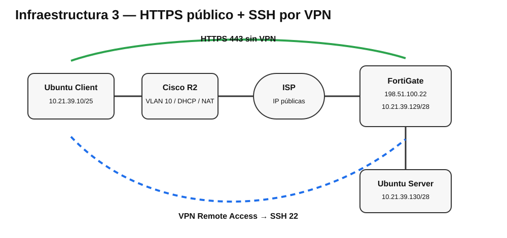

# Infraestructura 3 — HTTPS sin VPN y SSH por VPN Remote Access

## Propósito

Permitir que el usuario acceda al servidor WEB por HTTPS sin necesidad de VPN, mientras que el acceso administrativo por SSH solo se permite cuando el cliente establece una VPN Remote Access con FortiGate.

## Topología lógica

`Ubuntu-Client → SW-USERS → R2 → ISP → FortiGate → Ubuntu-Server`



## Direccionamiento

| Elemento | Dirección |
|---|---|
| VLAN 10 USERS | `10.21.39.0/25` |
| R2 Fa1/0.10 | `10.21.39.1/25` |
| Ubuntu Client | `10.21.39.10/25` vía DHCP |
| R2 Fa0/0 | `203.0.113.38/30` |
| ISP Fa1/0 | `203.0.113.37/30` |
| ISP Fa0/1 | `198.51.100.21/30` |
| FortiGate port1 | `198.51.100.22/30` |
| FortiGate port2 | `10.21.39.129/28` |
| Ubuntu Server | `10.21.39.130/28` |
| Pool VPN | `10.99.99.10-10.99.99.20` |

## HTTPS sin VPN

Se creó un VIP en FortiGate:

- Nombre: `WEB-HTTPS-VIP`
- Interfaz: `port1`
- IP externa: `198.51.100.22`
- IP mapeada: `10.21.39.130`
- TCP `443 → 443`

Política:

- `port1 → port2`
- Destino: `WEB-HTTPS-VIP`
- Servicio: HTTPS
- NAT: deshabilitado

Desde Ubuntu-Client se validó:

```bash
wget --no-check-certificate -T 5 -S -O- https://198.51.100.22/
```

Resultado: `HTTP/1.0 200 OK`.

## SSH únicamente mediante VPN

VPN creada con el asistente de FortiGate:

- Nombre: `VPN-REMOTE-SSH`
- Tipo: Dialup / FortiClient compatible
- Interfaz entrante: `port1`
- Grupo: `VPN-USERS`
- Red protegida: `10.21.39.128/28`
- Pool: `10.99.99.10-10.99.99.20`
- Split tunnel: habilitado
- IKEv1 Aggressive + XAuth + Mode Config
- Propuestas: DES/SHA1 y DES/MD5

La política VPN → servidor fue limitada a:

- Incoming: `VPN-REMOTE-SSH`
- Outgoing: `port2`
- Source: `VPN-REMOTE-SSH_range`
- Destination: `SERVER-NETX`
- Service: SSH
- NAT: deshabilitado

### Prueba sin VPN

```bash
ssh adrian@10.21.39.130
```

Resultado observado: `No route to host`.

### Prueba con VPN

StrongSwan estableció correctamente IKE SA y CHILD SA, asignando `10.99.99.10` al cliente y protegiendo `10.21.39.128/28`. Posteriormente el acceso SSH a `10.21.39.130` fue exitoso.

La configuración StrongSwan pública está sanitizada en [scripts/strongswan/](scripts/strongswan/).
